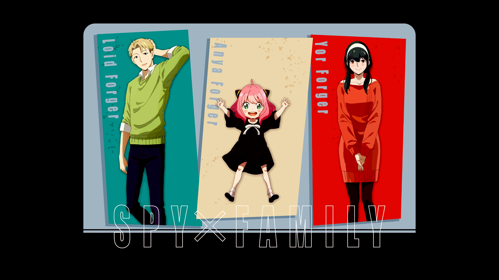

# 🎮 GianniFlix



Uma plataforma de streaming de animes com uma interface única inspirada em pixel art e design retro-futurista! 

## ✨ Características

- 🎨 Design único com tema retro-futurista e pixel art
- 🌟 Efeitos visuais especiais com partículas animadas
- 📱 Design totalmente responsivo
- 🎭 Cards de animes com efeitos de hover interativos
- 🎬 Seção de destaque com animes em evidência
- 🖼️ Galeria de animes favoritos
- 🎮 Ícones personalizados em pixel art

## 🛠️ Tecnologias Utilizadas

- HTML5
- CSS3 (com variáveis CSS e animações avançadas)
- JavaScript (Vanilla)
- Google Fonts (Press Start 2P)

## 🎯 Recursos Especiais

### Design System
```css
--primary-color: #ff0040
--secondary-color: #4b0082
--accent-color: #00f7ff
--background-color: #141414
--text-color: #ffffff
```

### Animações
- ✨ Efeito de partículas flutuantes
- 🌟 Animações de hover nos cards
- 💫 Efeitos de glowing text
- 🎮 Ícones pixel art animados

## 📱 Responsividade

O projeto é totalmente responsivo, adaptando-se a diferentes tamanhos de tela:
- 📺 Desktop (1400px+)
- 💻 Laptop (768px-1399px)
- 📱 Tablet (481px-767px)
- 📱 Mobile (até 480px)

## 🚀 Como Usar

1. Clone o repositório
```powershell
git clone [url-do-repositorio]
```

2. Abra o arquivo `index.html` em seu navegador

3. Para desenvolvimento, recomenda-se usar o Visual Studio Code com a extensão Live Server

## 🎨 Estrutura do Projeto

```
gianniflix/
├── css/
│   └── style.css          # Estilos principais
├── images/
│   ├── cards/            # Imagens dos cards de anime
│   ├── hero/             # Imagens das seções de destaque
│   └── icons/            # Ícones em pixel art
├── js/
│   ├── particles.js      # Sistema de partículas
│   └── script.js         # Scripts principais
└── index.html            # Página principal
```

## 🎵 Features Planejadas

- [ ] Sistema de reprodução de vídeos
- [ ] Sistema de busca
- [ ] Categorização por gêneros
- [ ] Sistema de favoritos
- [ ] Perfis de usuário

## 👾 Créditos

Desenvolvido com 💜 por Gianni

## 📜 Licença

Este projeto está sob a licença MIT. Veja o arquivo `LICENSE` para mais detalhes.

---

<p align="center">
Made with 🎮 by Gianni - 2025
</p>
